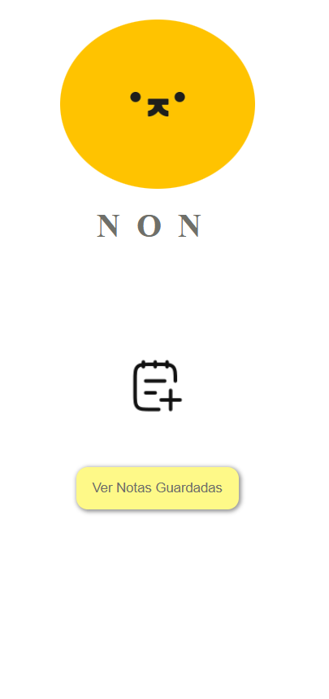

# App de Notas con Markdown- NON

Una aplicación web que permite a los usuarios crear, visualizar, editar y eliminar notas en formato Markdown, con vista previa en tiempo real. Las notas se guardan localmente en el navegador.

## Objetivo

Desarrollar una aplicacion web utilizando buenas practicas , tambien utilizar una nueva herramienta como vite y aprender el uso de las librerias en este caso markdown-it.

### Tecnologías Utilizadas

- HTML
- CSS
- JavaScript
- Git
- GitHub
- libreria markdown-it

## Componentes Principales

- Área de edición con sintaxis Markdown
- Vista previa en tiempo real del contenido escrito
- Guardado local de notas usando `localStorage`
- Listado de todas las notas guardadas
- Opciones para editar y eliminar notas

## Estructura del proyecto

```
/NON
├── index.html
├── note.html
├── contenidoNotas.html
├── notasGuardadas.html
├── /src
│   ├── js/
│   ├── css/
├── /public
│   └── assets/
│       └── images/
|__ vite.config.js
└── package.json

```
## Proyecto publicado en Netlify

Puedes probar la aplicación directamente en el siguiente enlace:

https://notan.netlify.app/

Al hacer clic, accederás a la app web de notas. Es sencilla de utilizar e intuitiva. ¡Explora y prueba todas sus funciones!

## Como ejecutar el proyecto de manera local

### **Clonar el repositorio**

```bash

git clone https://github.com/tu-usuario/tu-repositorio.git
```

### **Instalar dependencias**

En la terminal, ejecuta:

```bash

npm install
```

### **Ejecutar la aplicación en modo desarrollo**

```bash

npm run dev
```

### **Abrir la app en el navegador**

Copia y pega el enlace que te proporciona la terminal al ejecutar el proyecto. Generalmente suele ser el siguiente:

```
http://localhost:5173/

```

## Captura de Pantalla
